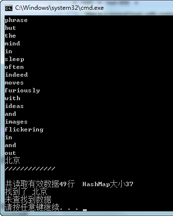

HashMapDemo

###基础

1、map内部数据的组织:map内部自建一颗红黑树(一种非严格意义上的平衡二叉树)，这颗树具有对数据自动排序的功能，所以在map内部所有的数据都是有序的，
由红黑树保证，因此很多函数执行的时间复杂度都是log2N。

2、哈希表（Hash table，也叫散列表），是根据key而直接进行访问的数据结构。
也就是说，它通过把key映射到表中一个位置来访问记录，以加快查找的速度。
这个映射函数叫做散列函数，存放记录的数组叫做散列表。

###Demo

    演示了hash算法的使用，hash冲突的解决。
    在哈希发算法的优化思路。

